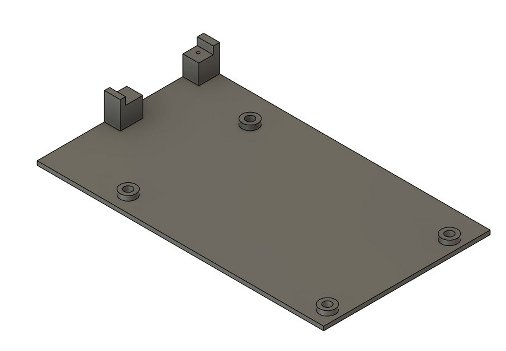

# ESP32 cnc3018 with WiFi and TFT touch UI - 3D Printing

**[Home](readme.md)** --
**[Installation](installation.md)** --
**[Software](software.md)** --
**[Electronics](electronics.md)** --
**[Hardware](hardware.md)** --
**3D Printing**

This page describes the plastic parts I added to the cheap chinese 3018 cnc
machine in the process of this project.

All of the **STL files** can be found in the [/docs/stl](stl) folder of this project.
In addition the **Fusion 360** files are available in the [/docs/fusion](fusion) folder.

## X and Y Limit Switches

In the 3D printing files there are designs and STL files for

- two pairs of mounts for the X and Y limit switches
- a generic plastic "t-nut", and
- a block which is used as a "y-stop".

The switches themselves are inexpensive automotive switches like
the following.  They are attached to the mounts with one 3mm screw
directly into the plastic in such a way that it provides the
pivot for the second screw, which is longer, and goes through
the slot, with a nut on the underside, so that the switch can swing
in an arc to adjust the contact point before tightening.

The mounts are attached to the frame with standard 5mm hex cap
bolts and t-nuts.

The shorter ones are the X limit switches. They are are hit by the
Z axis stepper motor body as the carriage traverses left and right.

The taller ones are for the Y axis, which I mounted on the
right side of the machine as you are facing it. One is mounted on the back
corner of the machine, and one is mounted just forward of
the right black plastic angle bracket.

The tall 3d printed block and plastic 5mm t-nut are used to attached
the Y-stops to the bottom of the platten and they are struck as
the platten moves forwards and backwards.

## Switch Connectors

I started by using standard automotive crimp connectors, and
that's fine if you want, but they were too big for the wire
I was using and kept falling off of the switches (I didn't
have the right size).

So, I went ahead and designed and printed my own connectors
for the switches, which connect firmly, protect the wires,
and are connected to the motor mounts with a 12x2mm screw
thru the slot to the mount (so the switch and and connector
can pivot together after loosening both screws)

I cut the brass into 4mm strips, bent them into shape, and soldered wire to the brass.
The cover is attached with some tiny (but surprisingly strong) self threading screws
directly into plastic.

FWIW I also used shielded cable (from some old RCA stereo cables) for all of the limit
switches on the machine.

## Z Limit Switches

The Z limit switches make use of smaller, slightly more expensive micro
switches like these:

The switches are attached to the printed mount with 2mm screws directly into
the plastic. The screws through to the original black plastic
X axis carriage frame in which I drilled very small holes to accept
them.  Likewise, the cover is attached with the same screws, but
longer, through to the original frame where possible.

The center bit, the "z-axis stop" is attached to the Z-axis spindle motor mount
with two 2 mm screws into tiny holes drilled into the motor mount. They can be
loosened and the bottom part can slide up and down to adjust the Z axis limit.

The z-axis zero position is fixed.

## General Wire Routing

I designed and printed a bunch (like 20) of these little "wire screws".

To use them you stuff the given wire into the slot on the frame, insert
the "wire screw" in line with the wire, and then twist it to the right
(clockwite) until it locks.  I use them in a number of places to tidy up and secure
the wires.

## Z Wire Routing

It is important (for me, at least!) as the machine works, and the X axis moves,
that the wires to the carriage are organized and well protected.   I have some
nice 1/2" black sheathing that works well to collect the spindle motor, z axis stepper
motor, and z axis limit switchs wires into a single bundle from the control board
to the X axis csarriage.

But it was also important that the whole bundle doesn't move around and/or
stress the connectors to the control board. So I decided to firmly attach the
bundle of wires to the frame of the machine on one end, and the top of the
Z axis stepper motor on the other end.

There are two assemblies (consisting of five parts in total) for this.

The first assembly, the "z wire up", attaches to the back of the frame next
to the controller board and secures the wire bundle at that point.
The "z-up" assembly is attached to the frame with a standard 5mm hex cap
bolts and t-nut.

The second asembly attaches to the top of the zAxis stepper motor by removing
two of the existing 3mm screws and replacing them with 3mm screws that are 10mm
longer than the originals. It has two caps to secure the wire bundle securely.

The wires are held in by a capd secured with two 3mm machine screws directly
into the plastic.
 gd
The assembly serves to direct the stepper motor cable downwards, the spindle
motor cable upwards, and the z-limit switch cable to the side in such a
way that it wont interfere with the x zero switch which contacts the body
of the stepper motor and works perfectly to keep them from hitting the
lcd screen, etc.

## Probe Switch Mount

The probe (just another "switch") presents itself as a 1/8" stereo jack on
the side of the machine so that the probe can easily be added or removed
from the machine.

The connectors are standard 1/8" stereo connectors, but I only
use the tip and ring:

I made the probe itself out of some multimeter test probes with
bananna plugs that attached to insulated alligator clips.

Once again, wherever possible ground shielded wire was used.

## PCB Mount

The PCB mount secures the PCB board to the frame with four 5mm hex bolts
and t-nuts.  After that the power supply assembly is plugged, and screwed
in.  This piece is wonky and depends entirely on the pin locations for
the connectors between the control board and the (hand made perfboard)
power supply/spindle motor control board.

Also please note that the SDCard support is a separate printed piece
and is super-glued onto the control board after fitting the SDCard into
the plug.  Then the SDCard board gets one screw to hold it firmly
in place on the control board.

## LCD and LED Mount

The LCD mount also holds a strip of five addressable ws2812 LEDs
similar to the photo below, but with five and a longer wire :-)

The LED strip is inserted into the top of the mount and then secured
in place with a backing plate and two tiny screws as in the photo
below.

The LCD is (gingerly) attached with four 3mm screws and nuts.  It is
important that there is no pressure on the glass screen (or else
the thing will think you are pressing a button)!!  The 3d print is
designed to support the lcd from the edge and corners of the circuit
board.  Tweak as necessary! But don't crank these four screws down.

The entire LCD mount assembly is then attached to the top of the frame
with two **3mm** hex bolts and t-nuts.

