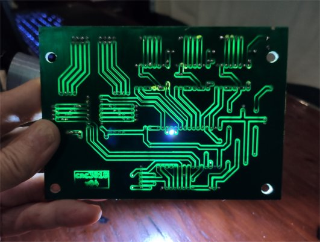
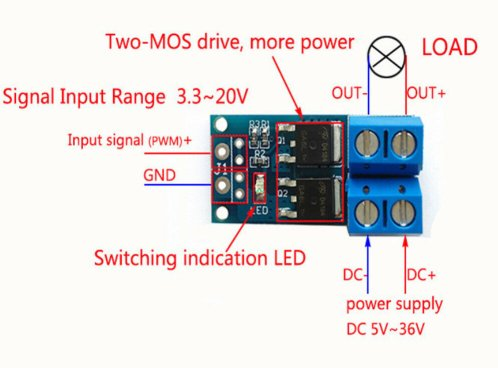

# esp32_cnc3018 - Electronics

**[Home](readme.md)** --
**[History](history.md)** --
**[Hardware](hardware.md)** --
**Electronics** --
**[Software](software.md)** --
**[Installation](installation.md)**

This page contains the circuit schematics and photos of the printed
circuit boards and their layouts.

The **kiCad** and **flatCam** files can be found in [/docs/kiCad](kiCad), including
all of the *libraries* needed, and the *Gerber* files and flatCam projects, as well
as the resultant **gCode** used to produce the circuit boards

You *may* need to add **libraries/cnc3018_Library.lib** and/or **cnc3018-PCB.pretty**
to your kiCad installation in order to view or modify the kiCad files.

## Main Controller Board

I will admit up-front to the fact that I really only understand so much
about designing circuits and circuit boards.   This is the first board I
have created with kiCad and flatCam and there was a lot to learn in the
process.

I have tried to put *filter capacitors* into the circuit appropriately,
particularly for the 74HC165 switch processing, but I think I am still
short some 100nf capacitors here and there.

Otherwise, it is a pretty straight forward Arduino-like circuit
with three **a4988** stepper controller boards.  You can determine
the pins that I am using for various things from the schematic, and/or
the C++ source code files.

You can click on the above image to get a PDF file of the schematic.

The extra jumpers in the diagram (labeled as "V#" for "via") are there
to provide the pcb design with "pads" that can be uncovered for "vias".
As a newby I could not figure out how to make kiCad include the "vias" in the
"pad" plot, and so I added them to the schematic, but they are not
"significant" in that they don't represent actual jumpers or components.
So, **please ignore the boxes labelled 'V#' in the schematic**!

You can see the specific ESP32 dev module I am using in other photographs.
It is the slightly smaller kind, with mounting holes.

I took a moment to take a photo of it with a light behind because it looks neat!

 

## LCD Connector

The LCD Connector just adds a few resistors and duplicates
the MISO/MOSI/CLK signals to the "touch" portion of the larger
TFT connector, winnowing the needed connections down to 8 pins
for the cable to the control board.

I soldered the 8 wires directly to the board and the other
end is a JST connector to the control board.

 

## Power Supply and Spindle Controller

The Power Supply and Spindle Controller board was designed to be pin compatible
with previous versions.

It consists, essentially, of the **jack** for the 24V power supply, an
**on/off switch**, a **step down buck convertor** to supply 5V to the
ESP32, and a **PWM MOSFET control module** to control the spindle motor.

It makes use of a **PWM Mosfet** module I bought on
[ebay](https://www.ebay.com/itm/292509712137)
that looks like this:

and a **Mini 360 step down buck convertor** module I bought on
[ebay](https://www.ebay.com/itm/223048616138)
that looks like this:

 

<a href='software.md'>NEXT</a><i> - Software Architecture</i>

