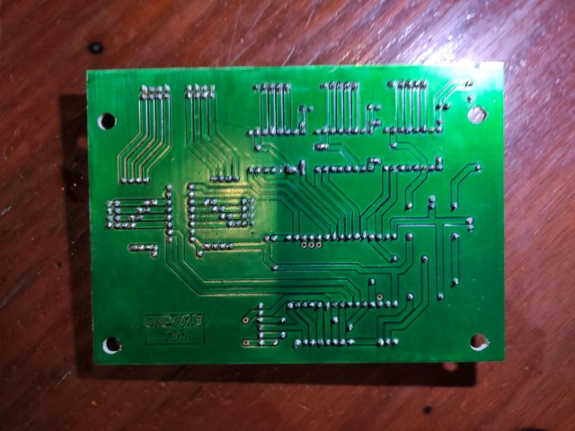

# CNC3018_ESP - Electronics

**[Home](readme.md)** --
**[History](history.md)** --
**[Hardware](hardware.md)** --
**[3D Printing](3dPrinting.md)** --
**Electronics** --
**[Software](software.md)** --
**[Installation](installation.md)**

This page contains the circuit schematics and photos of the printed
circuit boards and their layouts.

The **kiCad** and **flatCam** files can be found in [/docs/kiCad](kiCad), including
all of the *libraries* needed, and the *Gerber* files and flatCam projects, as well
as the resultant **gCode** used to produce the circuit boards

You *may* need to add **libraries/cnc3018_Library.lib** and/or **cnc3018-PCB.pretty**
to your kiCad installation in order to view or modify the kiCad files.

## Main Controller Board

I will admit up-front to the fact that I really only understand so much
about designing circuits and circuit boards.   This is the first board I
have created with kiCad and flatCam and there was a lot to learn in the
process.

I have tried to put *filter capacitors* into the circuit appropriately,
particularly for the 74HC165 switch processing, but I think I am still
short some 100nf capacitors here and there.

Otherwise, it is a pretty straight forward Arduino-like circuit
with three **a4988** stepper controller boards.  You can determine
the pins that I am using for various things from the schematic, and/or
the C++ source code files.

You can click on the above image to get a PDF file of the schematic.

The extra jumpers in the diagram (labeled as "V#" for "via") are there
to provide the pcb design with "pads" that can be uncovered for "vias".
I could not figure out how to make kiCad include the "vias" in the
"pad" plot.

You can see the ESP32 dev module I am using in other photographs.
It is the slightly smaller kind, with mounting holes.

## LCD Connector

The LCD Connector just adds a few resistors and duplicates
the MISO/MOSI/CLK signals to the "touch" portion of the larger
TFT connector, winnowing the needed connections down to 8 pins
for the cable to the control board.

I soldered the 8 wires directly to the board and the other
end is a JST connector to the control board.

## Power Supply and Spindle Controller

The input power to the stepper and spindle motors is 24V.

This board implements the MOSFET PWM spindle motor controller
and also has an onboard 5V buck convertor to power the ESP32.

I added some big (220uf and 300uf) capacitors to the board to
try to make it work better.  There is a jumper to disconnect
the buck power supply from the ESP32 as needed.

It works ok, but is a hodgepodge, and needs further work.
When I get it *right* I will incorporate it directly onto
the controller board, but for now I prefer it as a separate
module that I can experiment with.

 

<a href='software.md'>NEXT</a><i> - the Software</i>

