# CNC3018_ESP - Hardware

**[Home](readme.md)** --
**[History](history.md)** --
**Hardware** --
**[3D Printing](3dPrinting.md)** --
**[Electronics](electronics.md)** --
**[Installation](installation.md)**

This page contains photos and ancedotes about building this project.

## Limit Switches

The very first thing that everyone does to stock 3018's is adds limit switches.
So I 3D printed some mounts and stuck some limit switches on the machine. For
X and Y I just use the most ubiquitously available (cheapest!) switches, though
a bit large.  I went through multiple iterations on the Z axis, starting with
micro switches, but then relenting to using small (more expensive) lever switches.

[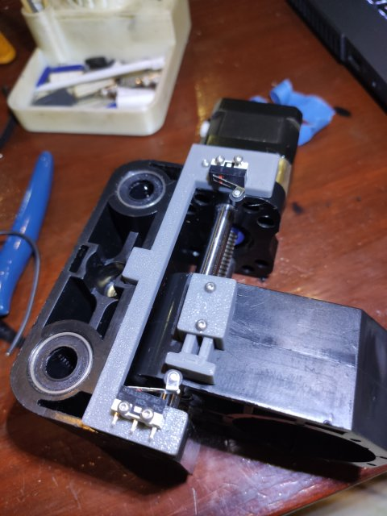](images/zAzisSwitch2_large.jpg)
[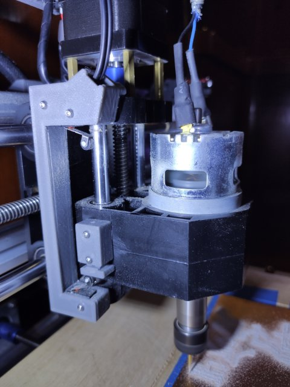](images/zAzisSwitch_large.jpg)

Everything in grey plastic is my 3D printed additions to the machine (the black
plastic is the original stuff).  The zAxis has a housing around the switches,
and an adjustable offset at the bottom (limit).  All the wires are shielded.

For the X and Y axis I originally started by using crimp on connectors that were
exposed, but didn't like them.  They kept falling off and the connectors were
too large for the wire I was using, so I 3D printed and constsructed my own connectors
using some thin brass sheet I've had sitting around for 20 years,

[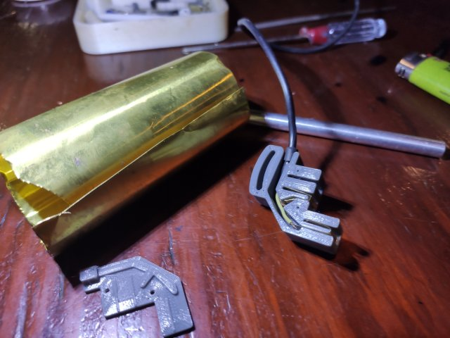](images/xyLimitSwitchConnector1_large.jpg)
[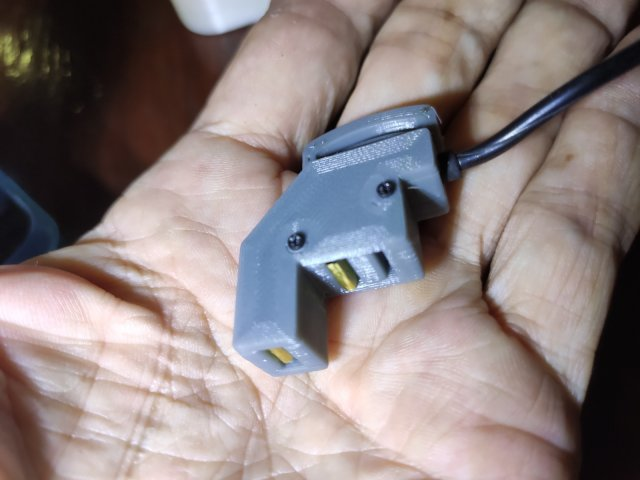](images/xyLimitSwitchConnector2_large.jpg)

The crimp connectors were loose and easily fell off if you bumped them.
These connectors are secured with screws to ensure they don't fall off!

## Initial Sensor Board

I found pretty quickly that even with the nice breadboards, I was having
problems with the switches becasuse the leads on the resistors are small
and don't make good contact with breadboards.  So I created a perf board
version with the 74HC165 IO multiplexer chip and plugged it into the
breadboard:

[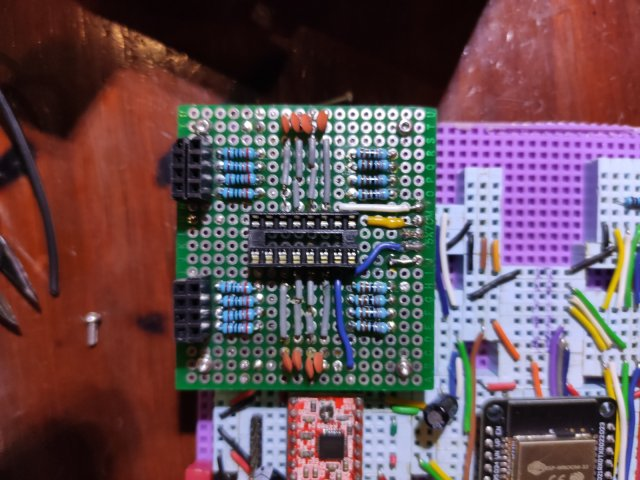](images/SensorPerfBoard_large.jpg)

## Milling the Controller Board

So, generally I got it working, but I was really anxious to eliminate the breadboard
and put a soldered board in place.   I was still getting problems due to the breadboard
and bad connections.

I had to learn a lot.  Spent time in  KiCad and Flatcam.   Designed it 10 times lol.
Cut some prototypes.  Learned a bit about applying and using green UV Solder Resist
Epoxy.

Finally got to where the following sequences of images looks practical :-)

### 1 - mill the board

[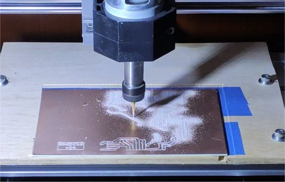](images/MillingBoard1_large.jpg)
[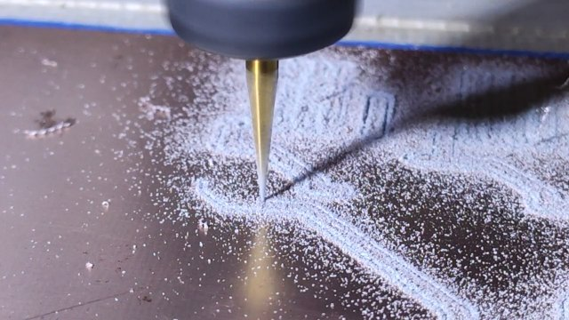](images/MillingBoard2_large.jpg)

In the end I had a pretty nice circuit board.  I will drill the holes after
doing the epoxy, so I then painted it with the green epoxy and exposed it
to the sun to cure the epoxy.

[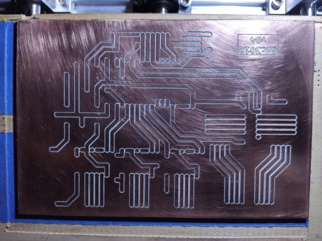](images/MilledBoard_large.jpg)

### 2 - mill the epoxy

OK, so I won't do this again!   It worked on this (v04) board, but subsquently
proved way too touchy to try to mill the UV epoxy off.  The copper layer is only
35/1000's of a millimeter ... like 2/1000's of an inch ... thick.   Even though
I added **mesh levelling** to the project, it is still nearly impossible to get
accurate enough to mill off the epoxy and NOT destroy the copper pads underneath.

[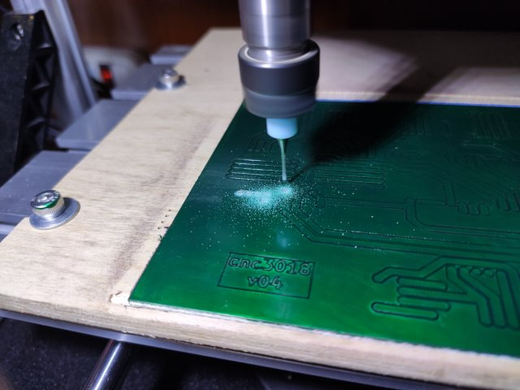](images/MillEpoxy2_large.jpg)
[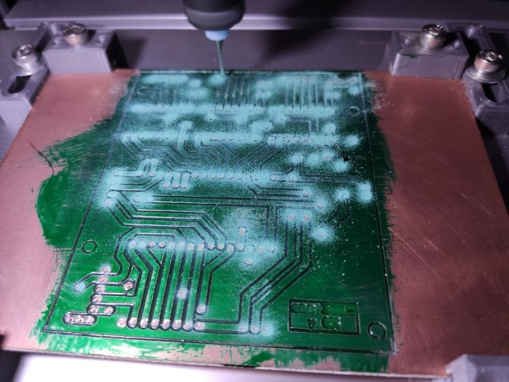](images/MillEpoxy_large.jpg)

The second photo above is actually a failure on an attempt to mill v05.
Most of the pads were destroyed because I was off by 1/100th of a millimeter!
Nonetheless it worked for this (V04) board and in the end I decided to use
V04 and move on.

I have ordered a UV laser.  My next idea is to expose the UV epoxy with the UV
laser on the cnc machine.  Photo masks are a bit complicated to work with!

### 3 - populate the board

Then it was pretty easy to solder on the headers, components, etc, and
I had a populated board.  It worked pretty much the first time!

[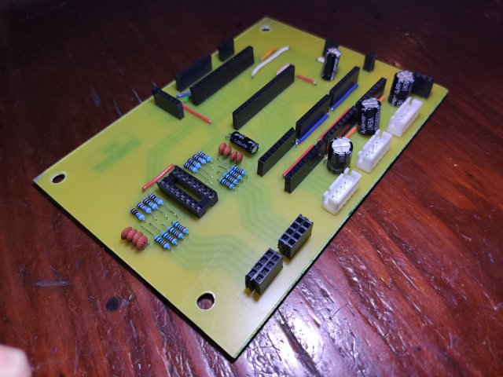](images/Populated1_large.jpg)
[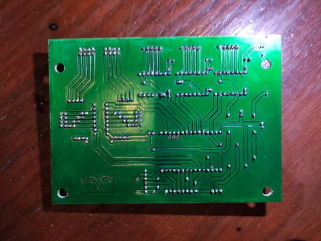](images/Populated2_large.jpg)

I took a moment to take a photo of it with a light behind because it looks neat!

[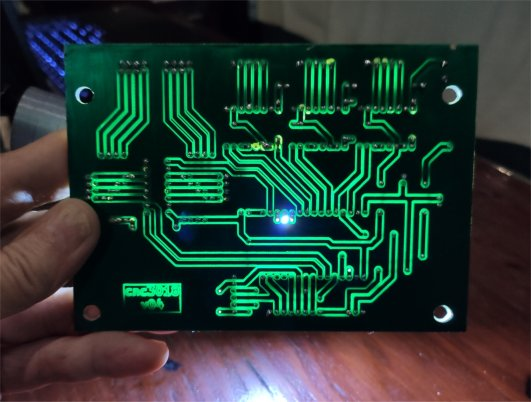](images/Transparent_large.jpg)

## Adding the touch screen

I put the board in the machine, and then used the machine to cut
another small circuit board to be used as a connector for the touch
screen:

[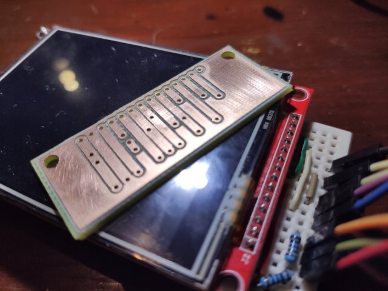](images/LcdConnector1_large.jpg)
[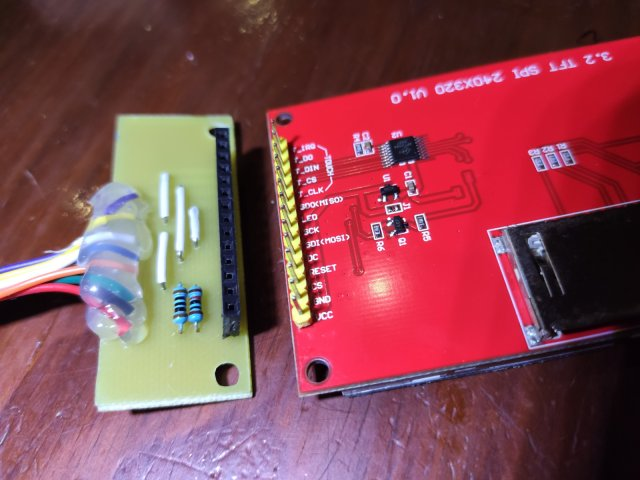](images/LcdConnector2_large.jpg)

After 3D printing an enclosure for it, and attaching it to the machine
(and reprinting it to add 5 ws2812b LEDs) I decided to write this page

[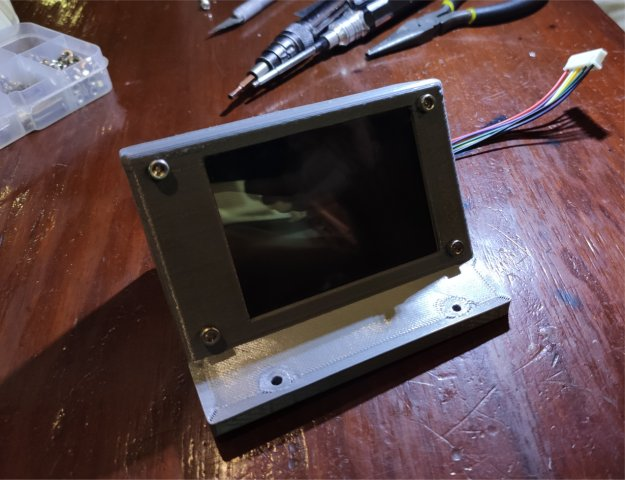](images/LcdEnclosure_large.jpg)
[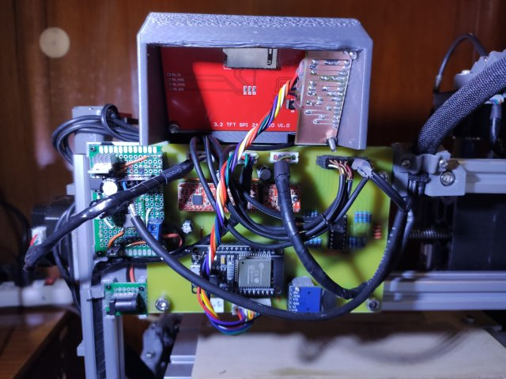](images/LcdAttached_large.jpg)

Here is the final machine:

[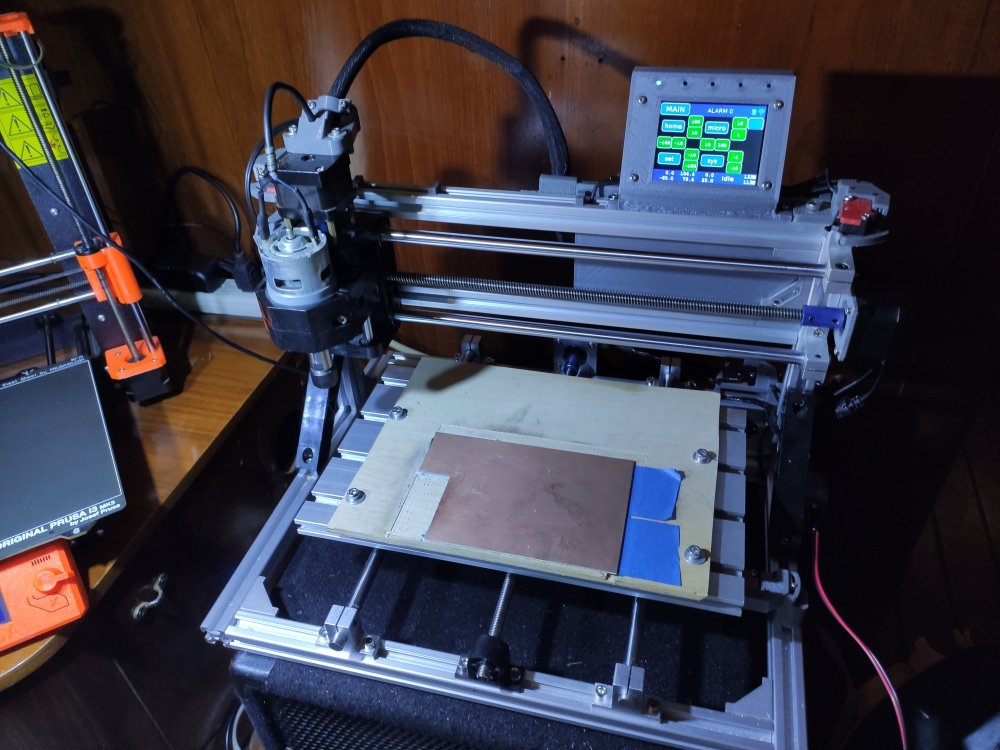](images/Machine1_large.jpg)

LOL, it still has the copper board from which I milled the LCD connector
on the work surface :-)

 

<a href='3dPrinting.md'>NEXT</a><i> - 3D Printing</i>

