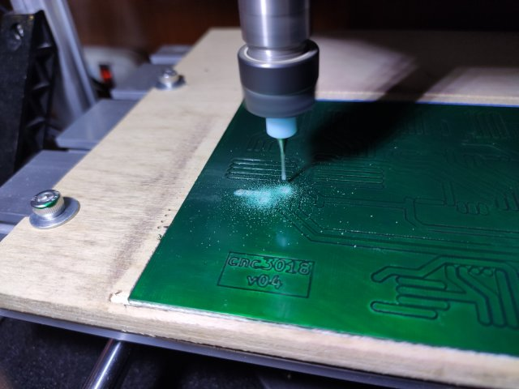
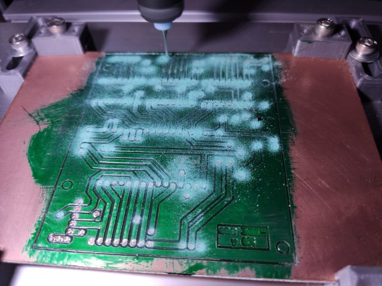

# CNC3018_ESP - History of this Project

**[Home](readme.md)** --
**History** --
**[Hardware](hardware.md)** --
**[Electronics](electronics.md)** --
**[Software](software.md)** --
**[Installation](installation.md)**

At my initial foray into CNC machines, I ordered the least expensive
CNC machine I could find, about $120, from [Ebay](https://www.ebay.com/itm/392298131168).  
It started as a generic **cnc 3018** machine like this:

While I was waiting for it to arrive, I started building the
[**vMachine**](https://github.com/phorton1/Arduino-_vMachine).
Weeks later, when the package with the 3018 arrived, I had just started developing the
[**touch screen UI**](https://github.com/phorton1/Arduino-libraries-FluidNC_UI)
on the vMachine.

At that time I was using a simple *breadboard* circuit
using these nice [5e Board](https://www.5eboard.com/product-category/5e-circuit-boards/)
breadboards.  They work good enough so that you can semi-persistently use
the resultant circuits, even going so far as mounting them on things.
They are definitely more resilient than the usual white breadboards.
They also allow for more flexible layouts, particularly with a SBC like
the ESP32 that doesn't really fit well on a typical breadboard.

So in the middle of the UI development, I decided to put the stock 3018 together.
I spent an afternoon constructing it, along with the included **Chronos
Control Board**.   I spent about 5 minutes verifying that it functioned
correctly with the Chronos board, then ***took the board off the machine***,
and proceeded that very day to start to create a breadboarded version of
a FluidNC based controller for the machine.

This is essentially the same circuit as the vMachine, except that (a)
the servo for the pen is replaced with another **A498** stepper
motor driver for the z-axis, (b) it has the additional responsibility
of providing the high voltage control of the 24V spindle motor, and
(c) it accommodates more limit switches.

 

## Spindle Control / Power Supply

The additional A498 would be easy, but I had to learn how to control
the spindle motor via PWM, opto-isolators, and large power MOSFETS.
And I didn't really have the correct parts on hand, or knowledge,
to do that.  The simple solution, to order a pre-existing "module"
for that took a while to achieve due to shipping times from China.
In the meantime I managed to burn out a number of other modules that
I had, along with various MOSFETS I had on hand, as most of them
were not up to the task of dealing with the 65-100W 24V motor, especially
when coupled with my ignorance :-)

Nonetheless, I proceeded with the basic breadboard controller
circuit, and a series of my own "power supply and spindle
controller modules" on perf board, as in the above photo.
I knew from my experiments that it would not be a good idea to
put the hot high power MOSFET on the plastic circuit board
and so I isolated that, and the buck-down 5V power supply
for the ESP32, on a separate circuit board.

In the end, a decent PWM module from China, which seemed
appropriate for this project, finally arrived, and it seems
to work pretty well.

 

## Z-Limit Switch

Another thing that underwent multiple revisions was the
Z Axis limit switches I designed.   I started by using
micro-switches and that worked well for a while, but
the micro switches eventually started failing.

TODO: photo of original z-limit switch.  They looked neat!

When something would go wrong during testing, the
Z-Axis would smash the little switches, which have
no *play* in them.  So, eventually I decided to use
larger micro switches with built-in stainless steel
lever arms.

 

## Sensor Board

I also found that, in use, when the cheap 24V spindle motor is creating
gobs of electrical noise, and trying to use fine-lead 1/4W resistors
in the breadboard, that the connections and noise were a problem and
were triggering, or failing to trigger, the limit switches.

The first solution to that was to create a perf-board version of
that *part* of the circuit, as shown above, where the connectors and resistors
were **soldered**, that *plugs in* to the plastic circuit board.
That helped quite a bit with the noise and false triggers.

I also started using all shielded cables for the spindle, stepper motors,
and limit switches about this time.

Of course I thought about making a soldered perf board version of the entire
circuit.  Perf boards are fine up to a certain point, but I wanted to make
an actual printed circuit board of some kind for this machine.

## Milling PC boards

At that point I just wanted to get the machine working well enough so that
I could use it to MILL it's own PCB :-)  And with the plastic breadboarded
circuit, along with the perf-board modules for the spindle-power supply and
sensors, I was able to do that, though it was a process and I had to learn
a lot in order to do so (this is my first "real" CNC machine lol)

In fact, a whole separate page *could* be dedicated just to describing
the process or learning how to mill PCB and my ongoing experiments
with **UV Cured Epoxy Solder-Resist** and **405nm lasers**, but a few
pictures will have to suffice for the time being.

## Summary

This project has been interesting and is a waypoint on my path of understanding
and developing CNC machine controllers.  It is difficult to explain the decision
making process that led me here, or why I think it has been worth the investment
of time to arrive at this point, but I will try to touch on the main points.

Let's just start by saying I had *CNC fever*.  It started with *robots* but then
I had some stepper motors sitting around, and I wanted to make *something*, so
I built the [**vMachine**](https://github.com/phorton1/Arduino-_vMachine).
While I was doing that I ordered a bunch of stuff to
make a variety of machines, including ordering the cheapest Chinese 3018 CNC
machines I could find.

I had already long ago decided that I was going to use the ESP32 and (at that
time) the Grbl_Esp32 codebase for my machines.   The lure of a $5 dual processor
240Mhz SBC with Wifi and BT is just too much!   No way was I gonna use the Arduino
based controller that came with the machines.  So I was thinking about that the
entire time I was developing the vMachine.

Grbl_Esp32 was subsequently renamed to FluidNC, and I subsequently forked and
modified it to be usable as an extensible Arduino library. I had already also
started TFT UI development, and so these diverse aspects came together during
this project.

 

<a href='hardware.md'>NEXT</a><i> - the Hardware</i>

