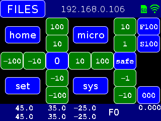

# CNC3018_ESP - Yet another cnc3018 Grbl Controller with WiFi and a TFT touch UI

**Home** --
**[History](history.md)** --
**[Hardware](hardware.md)** --
**[Electronics](electronics.md)** --
**[Software](software.md)** --
**[Installation](installation.md)**

CNC3018_ESP is my implementation of an inexpensive 3-axis CNC machine that
makes use of the **ESP32** processor.  Essentially I bought the cheapest
3-axis CNC machine I could find on [Ebay]( https://www.ebay.com/itm/392298131168), and then designed and implemented
my own controller board, limit switches, and extensions to that machine.

The ESP32 can easily be programmed from within the
Arduino development environment and has *dual cores*, runs at *240 Mhz* (as opposed to
the Arduino at 16Mhz) and comes with *520KB* (as opposed to 2KB) *of RAM*.  In addition
the ESP32 includes full onboard **WiFi and Bluetooth** capabilities, and can be had for
$5, or about half the price of a genuine Arduino.

Therefore my *primary design decision* was to base this, and my future CNC projects,
on an ESP32 processor.

**TODO: - VIDEO - introduction to the CNC3018_ESP**

TODO: Better picture of current CNC3018_ESP (rename to Esp32_cnc3018)

The CNC3018_ESP project is the 2nd machine in the line of open source
CNC machines I have created and published.  It provides a number of
features not commonly available in the lowest priced machines.

CNC3018_ESP includes a full **Web Browser User Interface** so that it can be
controlled wirelessly from your phone or computer via **WiFi**.  It can also be controlled
via the **serial port** on the ESP32, via **Telnet** on port 23, or via **Bluetooth**
for usage with commonly available gcode sender programs.
Finally, it can also store gcode files on the optional **SD Card** and run jobs entirely
locally, right on the ESP32, via the optional
[**Touch Screen User Interface**](https://github.com/phorton1/Arduino-libraries-FluidNC_UI)
, without involving any other devices.

This repository includes all of the files and information needed to modify
a stock entry level CNC 3018 machine as I have. It includes the files needed to
**3D print** the plastic parts, as well as the underlying Fusion 360 designs
if you need or want to modify the 3D printed parts. It includes all of the **schematics**
and information needed to breadboard or otherwise create the electronic circuits,
as well as the KiCad files behind those, and the Flatcam and GCode files I used to
mill my own **circuit boards** for this machine.

This project continues a **general approach** to
building ESP32 based CNC machines of various types.
It is entirely based on the next generation
[FluidNC](https://github.com/bdring/FluidNC)
project, a hugely important codebase that I have
forked and modified slightly so-as to better be able build projects
within the Arduino IDE development environment.

 

## Documentation

The documentation starts with this page, and includes the following additional
pages:

- **[History](history.md)** - my personal historical **perspectives** and
photos of the development process for the CNC3018_ESP machine
- **[Hardware](hardware.md)** - shows the physical
modifications to CNC 3018
- **[3D Printing](3dPrinting.md)** - details the **3D Printing** of
the plastic parts
- **[Electronics](electronics.md)** - the **schematics** and home made circuit
boards for the machine.
- **[Software](software.md)** - describes the **software** architecture of
CNC3018_ESP and FluidNC
- **[Installation](Installation.md)** - instructions on **building** and installing
the CNC3018_ESP firmware onto the ESP32 using the Arduino IDE environment.

 

## Please Also See

Please also see my previous CNC machine based on the same architecture,
my implementation of a V-Plotter, the
[**vMachine**](https://github.com/phorton1/Arduino-_vMachine),
built entirely from scratch.

These "machines"  are relatively small INO programs.  They are built on top of a
number of other libraries that provide the bulk of the functionality.

- [**FluidNC**](https://github.com/phorton1/Arduino-libraries-FluidNC) - the next generation **ESP32 GRBL** machine
- [**FluidNC_UI**](https://github.com/phorton1/Arduino-libraries-FluidNC_UI) - a *touch screen user interface* for FluidNC
- [**FluidNC_extensions**](https://github.com/phorton1/Arduino-libraries-FluidNC_extensions) - some extensions to FluidNC

The core of the machine, the GRBL (g-code) interpreter, is based on the
[**FluidNC**](https://github.com/phorton1/Arduino-libraries-FluidNC)
library.  The operational details of the machine, what g-codes
are supported, the basic serial command protocol, the wifi and webserver,
the machine configuration, and most functional aspects of the machine are
provided by this library.

On top of FluidNC I have built
[**FluidNC_UI**](https://github.com/phorton1/Arduino-libraries-FluidNC_UI),
the *touch screen user interface*, as a library that can optionally
be used in ESP32 CNC projects.
Please see this library for a **description of the *User Interface***.

I have also added a
[**FluidNC_extensions**](https://github.com/phorton1/Arduino-libraries-FluidNC_extensions)
library that contains a number
of features that are used in this, and other machines based on this system.
This library contains methods and objects to abstract and extend the FluidNC
core.  Specific contents at this time include:

- some easy to use debug/info/error **output methods**
- methods to abstract the **state** of the FluidNC machine
- methods to abstract **control** of the FluidNC machine
- methods to supplement the FluidNC **configuration** system, and
- an implementation of **mesh bed levelling** as used in this CNC3018_ESP machine

 

## Credits and License

This library is licensed under the
[GNU General Public License v3.0](https://github.com/phorton1/Arduino-CNC3018_ESP/tree/master/LICENSE.TXT)

**Credits**

- To **bdring** and the **FluidNC Team**

 

<a href='history.md'>NEXT</a><i> - more about CNC3018_ESP ...</i>

