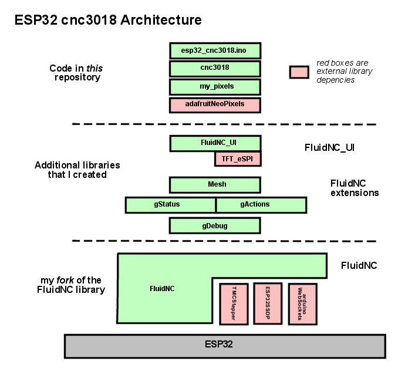

# esp32_cnc3018 - Software and Configuration

**[Home](readme.md)** --
**[History](history.md)** --
**[Hardware](hardware.md)** --
**[Electronics](electronics.md)** --
**Software** --
**[Installation](installation.md)**

The above diagram gives a birds-eye view of the architecture of the
esp32_cnc3018 software.

At the top, the *code in this repository* includes
the main *Arduino Sketch* **esp32_cnc3018.ino** file which
implements the usual Arduino *setup()* and *loop()* methods.

Below that the **cnc3018** layer/component *(cpp file)* contains the
**glue** (mostly overridden *weakly bound* methods) to **FluidNC**.
Most of the machine specific functionality is implemented in this
component.  It initializes the (optional) **pixels** below it,
and if included in the build, the lower level *FluidNC_UI* and
*FluidNC_exensions **Mesh*** features.

This machine has no machine specific *configuration settings*.

Below the *dotted line* in the digram are the other libraries and
code used by the esp32_cnc3018 machine.

In my architectural diagrams **visibility**
is connoted vertically in **layers**, and within layers there are
**components**. Typcially, but not always, *components* are synonymous
with C++ *classes*.
Things higher in the diagram *can see* (know about) the components and
layers below them, but things in lower layers cannot see (do not know about)
things above them.  Components at the same level in the diagrams have *varying
degrees* of visibility of one another, depending on the detailed design.

The esp32_cnc3018 machine makes use of my
[**FluidNC_extensions**](https://github.com/phorton1/Arduino-libraries-FluidNC_extensions)
library and my
[**FluidNC_UI**](https://github.com/phorton1/Arduino-libraries-FluidNC_UI)
library.  The FluidNC_UI library is in turn, dependent on the
[**TFT_eSPI**](https://github.com/phorton1/Arduino-libraries-TFT_eSPI)
library which is shown in **red**.
Within the FluidNC_extensions library there are a number
of components including the **gStatus**, **gActions**, and **gDebug**
objects and methods.

Below the seecond *dotted line* is
[**my fork**](https://github.com/phorton1/Arduino-libraries-FluidNC)
of the **FluidNC** project
repository.  The bulk of the actual functionality of the esp32_cnc3018 machine is
provided by this library.  It in turn depends on the **TMCStepper**,
**ESP32SSDP**, and **arduinoWebSockets** libraries.

And finally, at the bottom of the diagram is the **ESP32** hardware,
abstracted into a single box.

 

## esp32_cnc3018.ino

**esp32_cnc3018.ino**, as expected, contains the usual Arduino **setup()**
and **loop()** methods.

They more or less simply call the corresponding
**main_init()** and **run_once()** methods from *FluidNC*.

There is a little bit of additional code in esp32_cnc3018.ino to
optionally *initialize the SD Card* and *pixels*.  I found that initializing
the SD Card the very first thing in the program tends to be
the best, as the SDCard does not play well with other *SPI*
devices until it has been properly initialized.

 

## cnc3018.cpp

**cnc3018.cpp** contains the *glue* to FluidNC which takes the form
of a number of overriden *weakly bound* methods, including:

- **display_init()** - called early from FluidNC during the call to *main_init()*
- **machine_init()** - called from FluidNC during the call to *main_init()*

 

## my_pixels.h and cpp

Contain a thin wrapper around *adafruitNeopixels* along with
a **task** that updates a ws2812B LED strip in terms of the
state of the limit switches, probe, and overall system state.

 

## Please Also See

Please also see the other libraries and reposistories referenced on this page.

 

<a href='installation.md'>NEXT</a><i> - Installation and Configuration</i>

